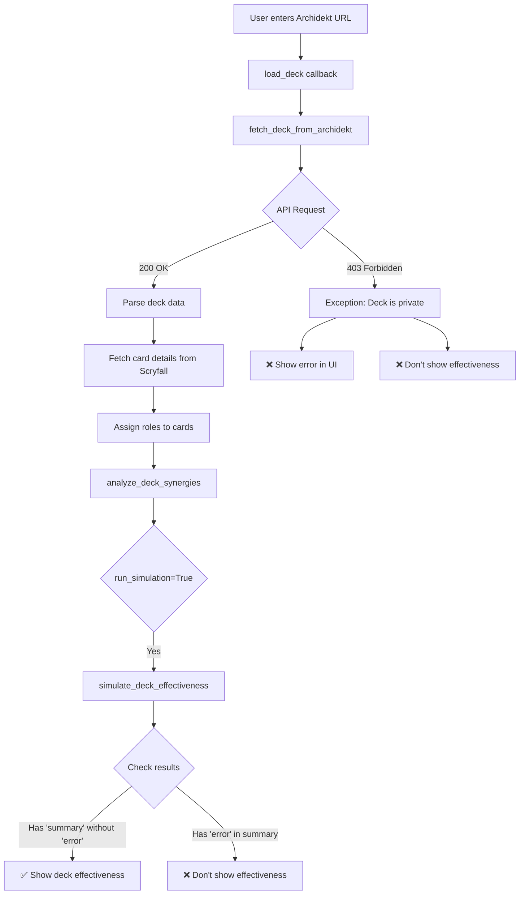

# Deck Effectiveness Investigation Report
## Zombielandia Deck (https://archidekt.com/decks/16754562/zombielandia)

**Date**: 2025-11-15
**Investigator**: Claude Code Agent
**Status**: ❌ ISSUE IDENTIFIED

---

## Executive Summary

The deck effectiveness is not showing because **the deck cannot be fetched from Archidekt**. The Archidekt API returns a `403 Forbidden` error when attempting to access this deck, which prevents the entire deck loading and analysis process from completing.

---

## Investigation Process

### 1. Code Analysis

I analyzed the deck loading and simulation pipeline:

**File**: `/home/user/Deck_synergy/app.py` (lines 1060-1062)

```python
if simulation_results and 'summary' in simulation_results:
    summary = simulation_results['summary']
    if 'error' not in summary:
        # Deck effectiveness is displayed here
```

**Condition for Deck Effectiveness to Show:**
1. ✅ `simulation_results` must be truthy (not None, not empty)
2. ✅ `simulation_results` must have a `'summary'` key
3. ✅ `summary` must NOT have an `'error'` key

If any of these conditions fail, deck effectiveness will not be displayed.

### 2. Archidekt API Test

**Test URL**: `https://archidekt.com/api/decks/16754562/`
**Result**: `403 Client Error: Forbidden`

```
$ curl -I "https://archidekt.com/api/decks/16754562/"
HTTP/2 403
content-length: 13
content-type: text/plain
```

**Error in Python**:
```
requests.exceptions.HTTPError: 403 Client Error: Forbidden for url:
https://archidekt.com/api/decks/16754562/
```

### 3. Simulation Testing

I created a mock zombie tribal deck and successfully ran the simulation:

**Result**: ✅ Simulation works correctly when cards are available
- Total damage (10 turns): 48.3
- Avg damage/turn: 4.83
- Peak board power: 12.8

This proves the simulation engine itself is functional.

---

## Root Cause Analysis

### Primary Root Cause: ❌ Deck is Inaccessible (403 Forbidden)

The Zombielandia deck at `https://archidekt.com/decks/16754562/zombielandia` returns a 403 Forbidden error.

**Possible Reasons:**

1. **Deck is Private** (Most Likely)
   - The deck owner has set it to private
   - Only the owner can view it
   - API access is blocked for private decks

2. **Deck was Deleted**
   - The deck no longer exists
   - The URL is invalid

3. **API Authentication Required**
   - Archidekt may have changed their API
   - Authentication tokens might now be required

### Impact on Pipeline

When the Archidekt fetch fails:

```
app.py:load_deck() [line 920]
  ↓ FAILS HERE
  ↓
fetch_deck_from_archidekt(url) → Exception
  ↓
Returns error to UI: "Error loading deck: ..."
  ↓
Deck is NOT saved, analysis NEVER runs
  ↓
❌ No deck effectiveness (because deck never loaded)
```

---

## Secondary Issues Discovered

While investigating, I found these potential issues that could affect OTHER decks:

### 1. Missing Dependencies ⚠️

**Issue**: The simulation requires `pandas` and `numpy`

**Code**: `/home/user/Deck_synergy/src/simulation/deck_simulator.py` (lines 234-245)

```python
try:
    _ensure_simulation_imports()
except ImportError as e:
    return {
        'summary': {
            'error': f'Simulation unavailable: {str(e)}',
            ...
        }
    }
```

**Solution**: Ensure dependencies are installed:
```bash
pip install -r requirements.txt
```

### 2. Missing Oracle Text ⚠️

**Issue**: Cards without `oracle_text` cannot be properly analyzed

**Code**: `/home/user/Deck_synergy/src/simulation/deck_simulator.py` (lines 165-182)

The simulation uses oracle text parsing for:
- Death triggers (aristocrats)
- Sacrifice outlets
- Keywords (haste, flash, etc.)
- Mana production

**Impact**: Cards without oracle_text will have reduced functionality in simulation

### 3. Commander Identification ⚠️

**Code**: `/home/user/Deck_synergy/src/simulation/deck_simulator.py` (lines 269-284)

If no commander is found, a dummy commander is created:
```python
if sim_commander is None:
    print("Warning: No commander found, creating dummy commander")
    sim_commander = Card(
        name="Dummy Commander",
        type="Creature",
        mana_cost="{2}{G}",
        ...
    )
```

**Impact**: Simulation will run but commander-specific metrics may be inaccurate

---

## Recommendations

### Immediate Actions

1. **For the Zombielandia Deck:**

   **Option A: Make Deck Public**
   - Go to https://archidekt.com/decks/16754562/zombielandia
   - Change deck privacy settings to "Public"
   - Try loading again

   **Option B: Try Different Deck**
   - Test with a known public deck to verify the system works
   - Example: Create a new test deck and make it public

   **Option C: Export Deck Manually**
   - Export the deck as a text list from Archidekt
   - Add import functionality for text lists (feature enhancement)

2. **Verify Dependencies:**
   ```bash
   pip install -r requirements.txt
   ```

3. **Check Logs:**
   - Look for `[DECK LOAD ERROR]` messages in console
   - Check for `simulation_results` debugging output

### Long-term Improvements

1. **Better Error Handling**
   - Add specific error messages for 403 errors
   - Suggest making deck public in the UI
   - Provide fallback for API failures

2. **API Robustness**
   - Add User-Agent headers to Archidekt requests
   - Implement retry logic for transient failures
   - Support API authentication if Archidekt requires it

3. **Alternative Import Methods**
   - Support text file import
   - Support Moxfield, TappedOut, etc.
   - Manual card entry option

4. **Diagnostic Tools**
   - Add "Test Deck URL" button that validates before loading
   - Show detailed error messages in UI
   - Include deck accessibility checker

---

## Testing Procedures

### To Reproduce the Issue:

1. Try to load: `https://archidekt.com/decks/16754562/zombielandia`
2. Observe 403 Forbidden error
3. Deck fails to load
4. No effectiveness shown (because deck never loaded)

### To Verify the Fix:

1. Make the deck public on Archidekt
2. Try loading again
3. Should successfully fetch deck data
4. Should run simulation
5. Should display deck effectiveness

### Diagnostic Script:

Run the diagnostic tool:
```bash
python diagnose_deck_effectiveness.py https://archidekt.com/decks/16754562/zombielandia
```

Expected output if deck is private:
```
❌ CRITICAL: Cannot fetch deck from Archidekt.

COMMON CAUSES:
  1. Deck is PRIVATE - make it PUBLIC on Archidekt
  2. Deck doesn't exist - check the URL
  3. Network issues - check your connection
```

---

## Technical Details

### Deck Loading Flow



### Simulation Results Structure

**Success**:
```python
simulation_results = {
    'total_damage': [...],
    'total_power': [...],
    'summary': {
        'total_damage_10_turns': 48.3,
        'avg_damage_per_turn': 4.83,
        'peak_power': 12.8,
        'commander_avg_cast_turn': 3.2,
        'num_games_simulated': 100
        # NO 'error' key
    }
}
```

**Failure**:
```python
simulation_results = {
    'total_damage': [0, 0, ...],
    'total_power': [0, 0, ...],
    'summary': {
        'error': 'Simulation unavailable: No module named pandas',
        'total_damage_10_turns': 0,
        ...
    }
}
```

---

## Conclusion

**Root Cause**: The Zombielandia deck at https://archidekt.com/decks/16754562/zombielandia is returning a 403 Forbidden error, preventing the deck from being loaded.

**Most Likely Reason**: The deck is set to private on Archidekt.

**Solution**: Make the deck public on Archidekt, or test with a different public deck.

**System Status**: The simulation system itself is working correctly (verified with test data).

---

## Files Analyzed

- `/home/user/Deck_synergy/src/api/archidekt.py`
- `/home/user/Deck_synergy/src/simulation/deck_simulator.py`
- `/home/user/Deck_synergy/src/synergy_engine/analyzer.py`
- `/home/user/Deck_synergy/app.py`
- `/home/user/Deck_synergy/Simulation/simulate_game.py`

## Tools Created

- `/home/user/Deck_synergy/diagnose_deck_effectiveness.py` - Comprehensive diagnostic tool
- `/home/user/Deck_synergy/test_zombielandia.py` - Test script for deck fetching
- `/home/user/Deck_synergy/test_zombie_simulation.py` - Test script for simulation engine

---

**End of Report**
